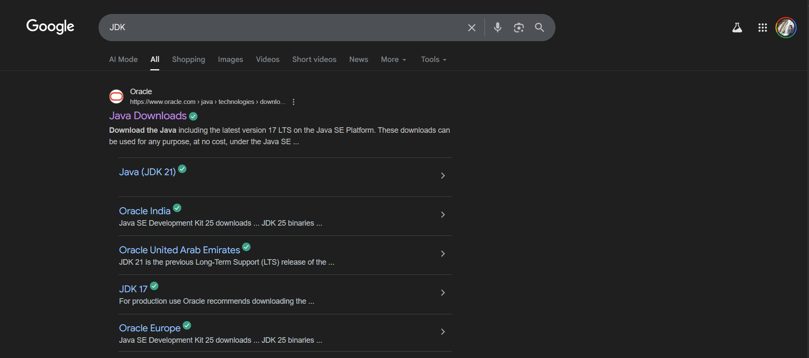
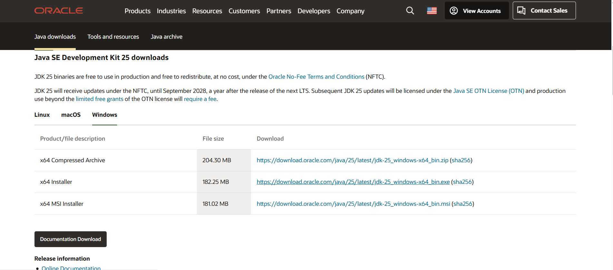
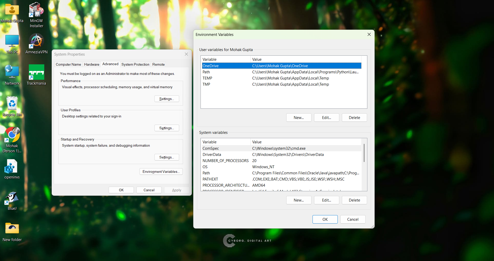

# A Student and Course Management System in Java

## Overview
This is an educational course and enrollment management system built with Java. It's designed as a **Command Line Interface (CLI)** to demonstrate core concepts of **Object-Oriented Programming (OOP)**, such as **encapsulation, inheritance, and builder pattern.**
 
---

## Core Features
- **Course & Instructor Management:**  Create, assign, and manage courses and instructors.
- **Enrollment & Grading:**  Seamlessly enroll students in courses and assign grades.
- **User-Friendly CLI:**  A straightforward, menu-based interface for easy navigation.
- **Data Handling:**  Uses NIO.2 for CSV file operations, enabling data import and export.

---

## Description 
The project is built on Java SE (Standard Edition), the foundational platform for general-purpose applications. While Java has evolved significantly since its debut in 1995, the "Write Once, Run Anywhere" philosophy remains a key feature, driven by the Java Virtual Machine (JVM).

---

# JAVA Evolution:

**Java 8 (2014):** A pivotal release that introduced Lambda expressions and the Streams API, which are utilized in this project's business logic.

**Java 17 (LTS):** The current long-term support version, which includes modern features like Records and Sealed Classes.

# Essential Components:

**JDK (Java Development Kit):** The complete toolset for developing Java applications, including the compiler and debugger.

**JRE (Java Runtime Environment):** Provides the JVM and standard libraries required to run Java applications.

---
##  Project Structure
edu/

└── ccrm/

├── Main.java # Entry point of the application

├── cli/

│ └── Menu.java # Command-line interface (menu system)

├── config/

│ └── AppConfig.java # Application configuration

├── domain/

│ ├── Course.java # Course entity

│ ├── Enrollment.java # Enrollment entity

│ ├── Grade.java # Grade entity

│ ├── Instructor.java # Instructor entity

│ ├── Person.java # Base class for people (students/instructors)

│ └── Name.java # Name handling class

└── README.md # (This file)

##  Requirements
- Java JDK 11 or above  
- A terminal/command prompt  
- (Optional) An IDE like IntelliJ IDEA, Eclipse, or VS Code  

---
## Steps to Install JAVA:

Steps in order to install Java JDK:

### 1. Downloading JAVA:
Search Java JDK go to [Oracle Website](https://www.oracle.com/java/technologies/downloads/).

### 2. Run Installer:
Run the downloaded installer and complete setup using instructions.

### 3. Add Path:
Add path to environment variables.

##  How to Run / Useage
**Step 1:** just download and paste this folder on your desktop .

**Step 2:** go the cmd file open it with notepad ,  change '\Mohak Gupta\' in cd /d C:\Users\Mohak Gupta\Desktop to your desktop path, save the file .

**Step 3:** run the cmd . 
